<div align="center">

# 音谷 - AI 多角色多情绪配音平台

</div>
<p align="center">

<!-- 🌟 官方链接徽章 -->
<a href="https://sw4s2hg7k5y.feishu.cn/wiki/WjbUw1t7JiWIa7k2pFXcxqSbnde?from=from_copylink">
  
</a>


</p>

> 一个开源的多角色、多情绪 AI 配音生成平台，支持小说、剧本、视频等内容的自动配音与导出。  

---
## 📝 详细使用文档
[音谷 - AI 多角色多情绪配音平台使用教程](https://sw4s2hg7k5y.feishu.cn/wiki/WjbUw1t7JiWIa7k2pFXcxqSbnde?from=from_copylink)
## 📖 软件简介
- **软件名称**：音谷 - AI 多角色多情绪配音平台  
- **定位**：为小说、剧本、视频等内容提供多角色、多情绪的 AI 语音合成与配音服务  
- **主要功能**：
  - 小说 / 剧本文本导入
  - 多角色角色库管理
  - 情绪音色选择与绑定
  - 台词自动拆分与配音生成
  - 批量任务管理与导出
  - 支持自定义 LLM 接口选择与调用
  - 基于Index-TTS-2.0的多情绪TTS服务
  - 支持精准的音频编辑功能，可以自定义删除音频片段或者添加静音片段。
  - 支持自定义提示词，适配个性化拆分需求
## 🛠 技术栈
- **前端**：Electron + Vue + Element Plus  
- **后端**：FastAPI / Python
- **AI 接口**：兼容 OpenAI API 协议的大模型  
- **TTS 服务**：IndexTTs-2 + Cloud Native Build 平台（免费 H20 显卡支持）/ 本地部署整合包

## 二次开发说明
本软件基于 AGPL-3.0 协议发布。若您在此基础上进行二次开发，请务必在软件界面与代码说明中明确标注：
“本软件基于开源项目《音谷》进行二次开发”，并附上本项目的链接，谢谢支持。

如需 私有化部署定制 或 商业定制服务，欢迎与我联系。

## 🚀 快速开始

### 1️⃣ 克隆项目
```bash
git clone https://github.com/xcLee001/SonicVale.git
cd SonicVale
```
### 2️⃣ 启动后端
首先，需要下载ffmpeg.exe到app/core/ffmpeg/ffmpeg.exe


可以去官网[ffmpeg](https://www.gyan.dev/ffmpeg/builds/packages/ffmpeg-8.0-full_build.7z)
。也可以使用[此镜像](https://www.alipan.com/s/ey5QRqW3Jji)

然后复制到app/core/ffmpeg/目录下

安装依赖和启动服务
```bash
cd SonicVale
pip install -r requirements.txt
uvicorn app.main:app --reload --port 8200
```


```
app/
├── core/               # 全局配置、tts引擎、llm引擎、ffmpeg封装、字幕生成、websocket、异步队列
├── db/                 # 数据库连接和Base
├── models/             # ORM模型
├── dto/                # 数据传输对象（请求/响应验证）
├── entity/             # 实体类（结合 ORM 与业务层）
├── repositories/       # 数据库封装
├── services/           # 核心业务逻辑
├── routers/            # FastAPI路由接口
└── main.py             # FastAPI启动入口

```


### 3️⃣ 启动前端
```bash
cd sonicvale-front
npm install   # 安装依赖
npm run start # 启动前端包括electron
```


## 🎥 效果演示
👉 [点击查看 B 站演示效果视频](https://www.bilibili.com/video/BV1tSpTz6EBH/)

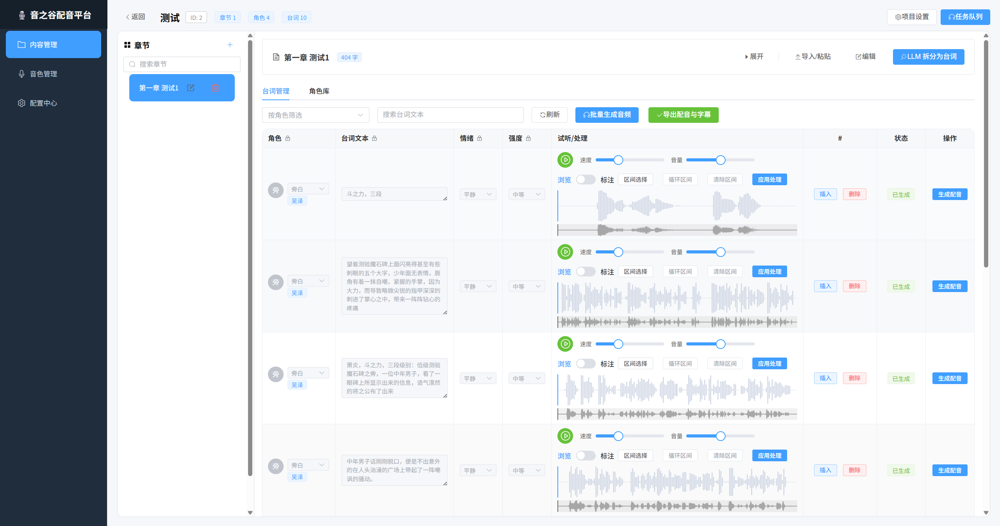
## 📷 截图

LLM 配置界面


TTS 配置界面
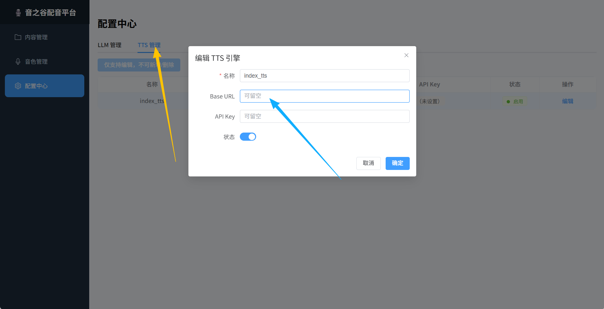

音色管理界面
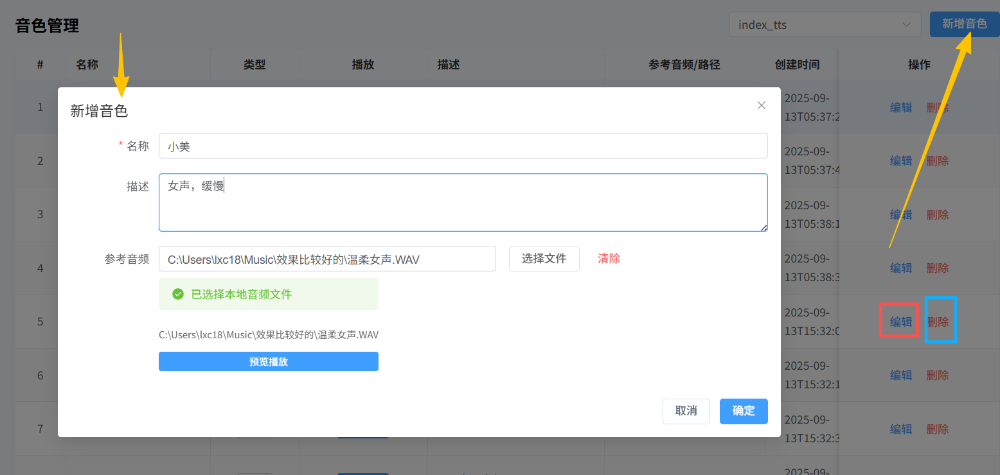

项目创建界面
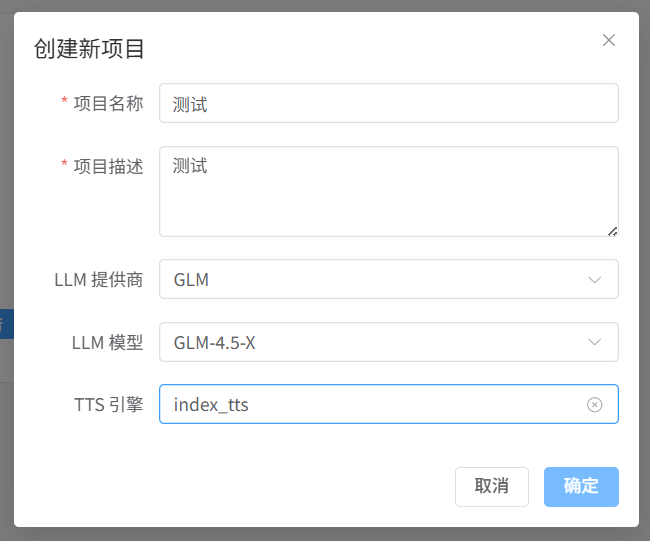

章节创建界面
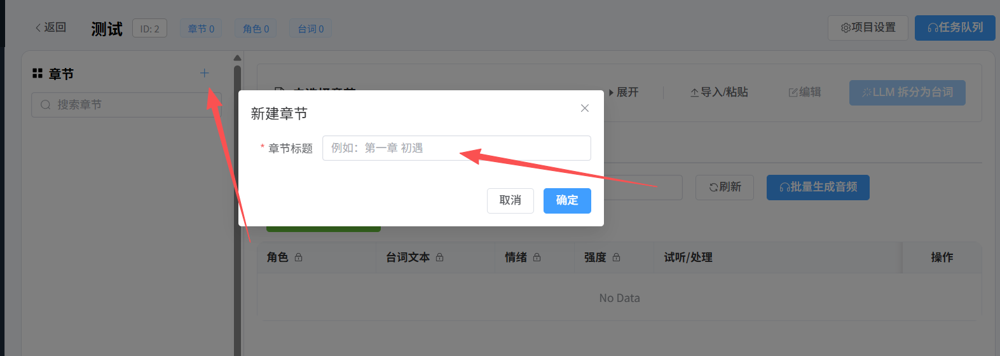

章节内容导入
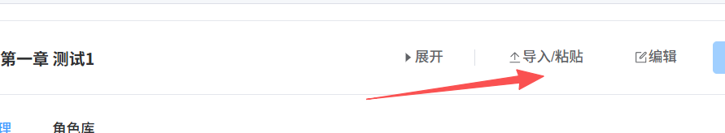

台词自动拆分
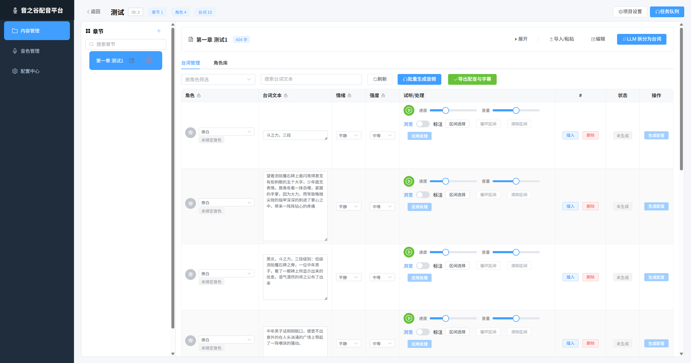

角色绑定，多章节共享角色音色
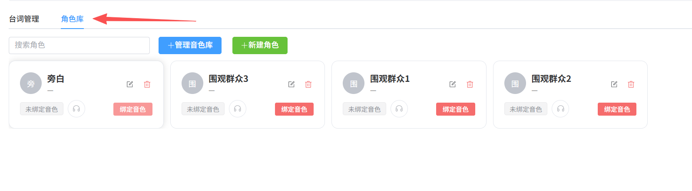

台词编辑，高度自定义
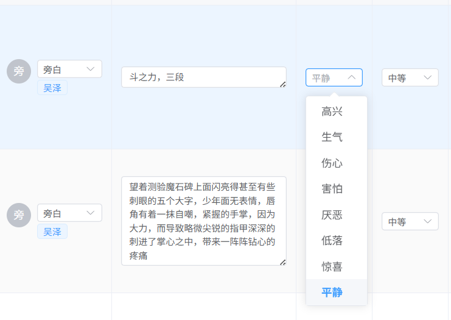
  - 在台词编辑区，用户可手动修改：
    - 台词文本
    - 角色归属
    - 情绪类型
    - 情绪轻度
  - 修改后自动保存并更新。

配音生成
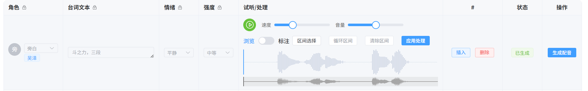

生成后音频可编辑
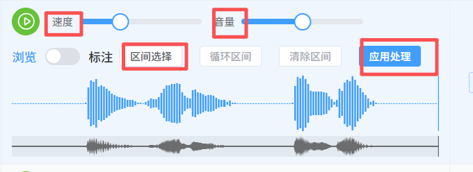


## 📬 联系方式

如果在使用过程中遇到 **Bug** 或者有 **功能建议**，请通过 [GitHub Issues](https://github.com/xcLee001/SonicVale/issues) 提交，这样可以帮助我们更好地跟踪与解决问题。  

如果你希望加入用户交流社区，欢迎加入我们的 QQ 群：  

- 💬 QQ交流群：1060711739 （验证信息请填写 “音谷配音”）

## 📜 协议

本项目采用 [GNU Affero General Public License v3.0 (AGPL-3.0)](./LICENSE) 开源协议。  

您可以自由地使用、复制、修改、合并、发布和分发本软件及其副本，但必须遵守以下条款：

- 您必须在分发的软件中包含原始许可声明和版权声明。

- 若您修改并发布本软件，或通过网络提供服务（如 SaaS、Web 应用），您必须同时公开修改后的源代码。

- 您不得附加任何与 AGPL-3.0 条款冲突的限制。

## ⚠️ 免责声明

本项目仅供学习与研究使用。  
用户不得利用本项目从事任何违法违规行为，包括但不限于：  
- 克隆或模仿未经授权的声音；  
- 侵犯他人声音权、肖像权、著作权、名誉权；  
- 其他可能违反法律法规的行为。  

开发者不对用户使用本项目所产生的任何后果负责，所有风险与责任由用户自行承担。  
使用本项目即表示您已阅读并同意本免责声明。  

---

## ⚠️ Disclaimer

This project is intended for research and educational purposes only.  
Users are strictly prohibited from using this project for any unlawful activities, including but not limited to:  
- Cloning or imitating voices without authorization;  
- Infringing upon the rights of others (voice rights, portrait rights, copyrights, reputation rights, etc.);  
- Any other activities in violation of applicable laws and regulations.  

The developer shall not be held liable for any consequences arising from the use of this project.  
All risks and responsibilities lie solely with the user.  
By using this project, you acknowledge that you have read and agreed to this disclaimer.
